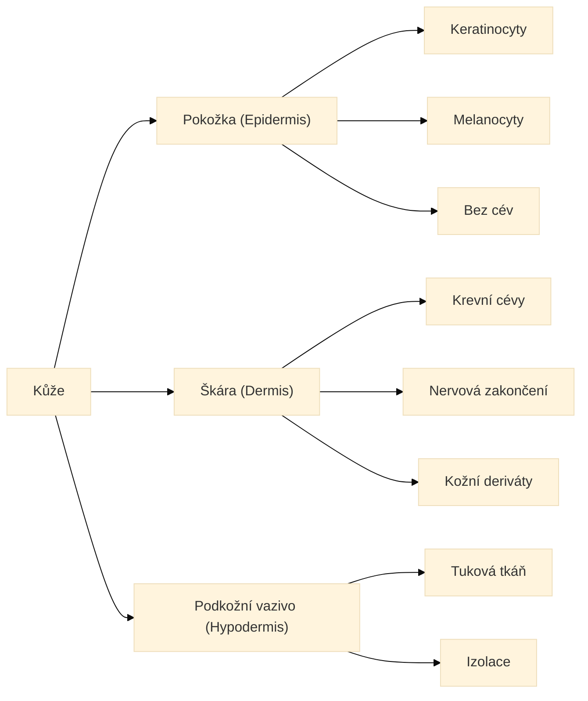
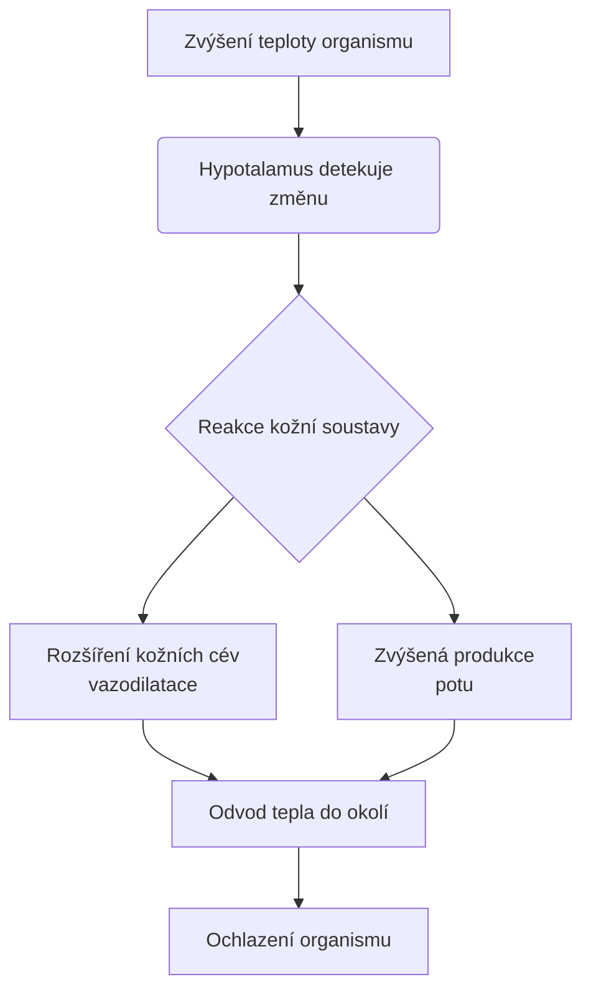

## **Kožní soustava člověka (Integumentum commune)**

Kůže je největší orgán lidského těla. U dospělého člověka dosahuje plochy 1,5 až 2 m² a tvoří přibližně 7 % celkové tělesné hmotnosti. Její hlavní funkcí je ochrana organismu před vlivy vnějšího prostředí, termoregulace, smyslové vnímání a exkrece.  
Pro hlubší studium doporučujeme navštívit [článek o kůži na české Wikipedii](https://cs.wikipedia.org/wiki/K%C5%AF%C5%BEe).  

<!-- ID: chk_kuze_obecne -->

## **Vrstvy kůže a kožní deriváty**

Kůže se anatomicky dělí na tři základní vrstvy, z nichž každá má specifickou buněčnou stavbu a funkci. Zde je jejich přehledné rozdělení:  

Mezi kožní deriváty (přídatné orgány kůže) patří vlasy, chlupy, nehty a kožní žlázy (potní, mazové a pachové). Tyto struktury se vyvinuly z pokožky, ale zasahují hluboko do škáry.  
<!-- ID: chk_vrstvy -->

## **Termoregulace**

Jednou z nejdůležitějších funkcí kůže je **termoregulace**. Kůže pomáhá udržovat stálou tělesnou teplotu prostřednictvím krevních cév a potních žláz. Níže uvedený diagram ukazuje reakci organismu na přehřátí: 

<!-- ID: chk_termoregulace -->
